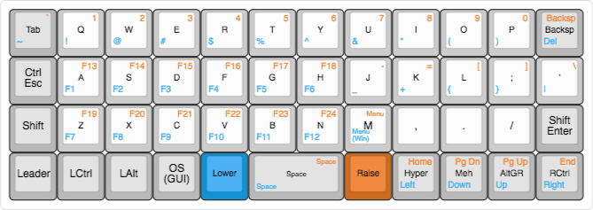
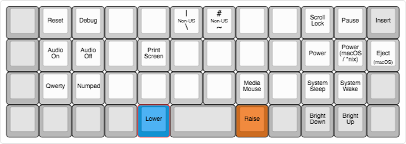

# SHM Keymaps

## Keyboard Information
- Keyboards are powered by [QMK Firmware.](https://qmk.fm/)
- [QMK Firmware Documentatiion](https://docs.qmk.fm/)

### To Implement
- custom USB cables
- [macro for snipping tool in Windows](https://old.reddit.com/r/olkb/comments/ajto81/macro_help/)

## Planck
### Layers

### Key Definitions
- Meh: Left Control, Shift and Alt
- Hpyer: Left Control, Shift, Alt and GUI
- GUI: Windows Key/Command Key/ Super Key

### Leader Definitions
- leader + shm: "Sarah H. McGrath"
