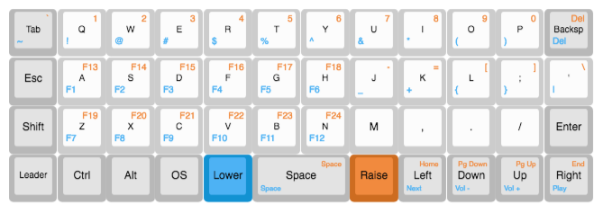
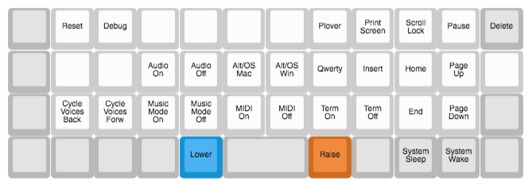
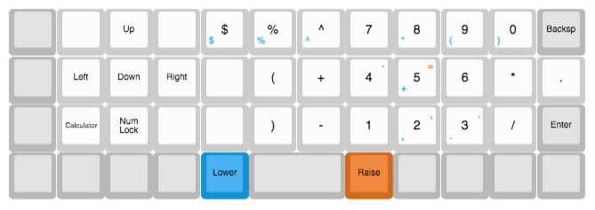
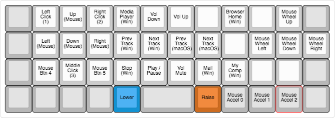

# SHM Keymaps

## Planck

### Layers

### Key Definitions
- Meh: Left Control, Shift and Alt
- Hpyer: Left Control, Shift, Alt and GUI
- GUI: Windows Key/Command Key/ Super Key

### Leader Definitions
- leader + shm: "Sarah H. McGrath"
